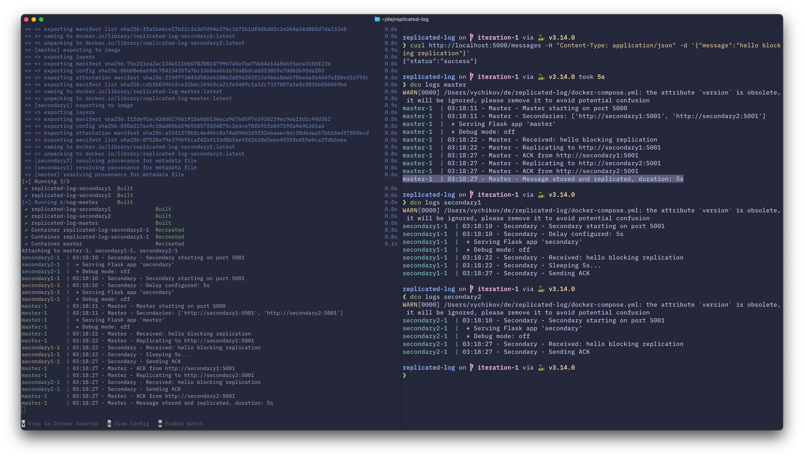

# Replicated log, iteration 1

in terminal 1:

```bash
docker-compose up --build
```

in terminal 2:

```bash
curl http://localhost:5000/messages -H "Content-Type: application/json" -d '{"message":"hello blocking replication"}'
```

Result:

Logs show that master responded after receiving ACKs from both secondaries, including the delayed one (which caused the response to take 5s).