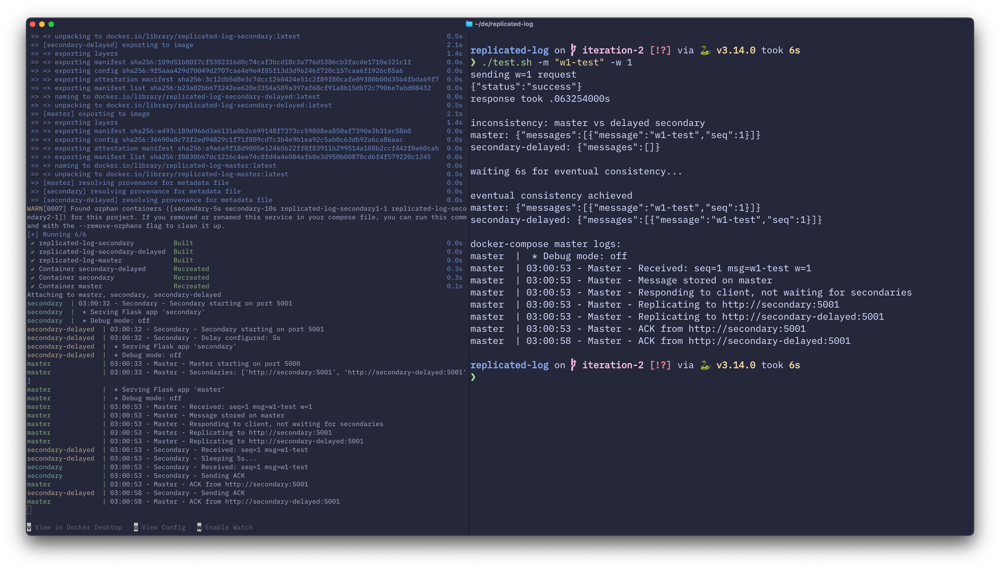
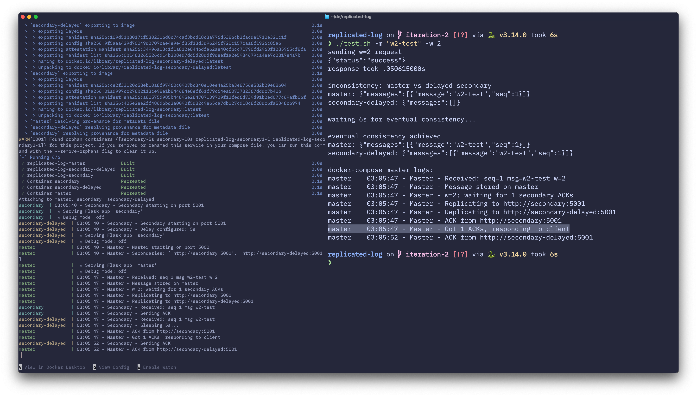
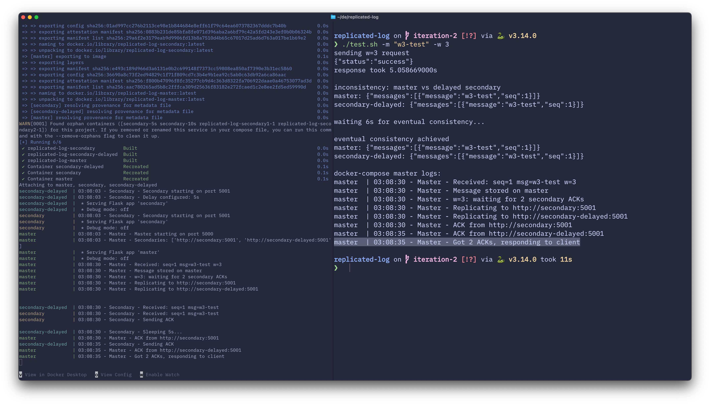

# Replicated log, iteration 2


## in terminal 1

```bash
docker-compose up --build
```

## in terminal 2

Run `test.sh` which is small script that:

* takes the message and write write-concern
* runs the request
* times the response
* and demonstrates inconsistency and eventual consistency by showing master and delayed secondary messages immediately after response and then after 6 seconds (delay is set to 5s)
* shows last request logs from master

## Results

### w=1

Logs show the response immediately after storing the message, ACKs from secondaries arrive after.

---

### w=2

Logs show the response after receiving 1 ACK. ACK from the delayed secondary arrives after.

---

### w=3

Testing script output shows that request took ~5s and at no point after response logs are inconsistent.  
Logs show that master responded after receiving 2 ACKs from both secondaries, including the delayed one (which caused the response to take 5s).